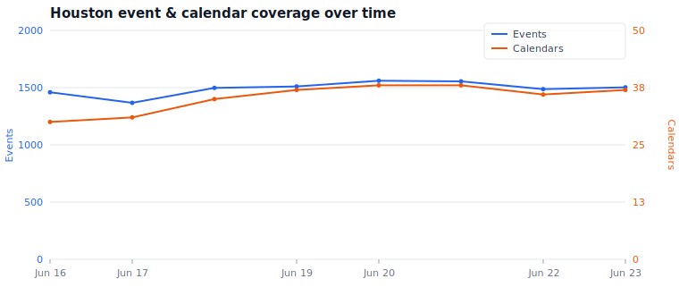

# 832.events

Subscribe to Houston-area event calendars in your favorite calendar
app. This project scrapes event data from local websites, ICS feeds, and
APIs, then publishes them as standard iCalendar (.ics) files you can add to
Google Calendar, Apple Calendar, Outlook, or any other calendar application.

**https://832.events/**

## Coverage over time

Event and calendar counts from each daily build. Regenerated and committed to
`main` automatically — see `scripts/update-event-history.mjs`.

Built from the [832.events city template](https://github.com/prestomation/206events)
— see `docs/SETUP.md` for the full setup walkthrough, `docs/city-template.md`
for how this instance is configured, and `AGENTS.md` for the agent-driven
maintenance workflow.

## Getting started

1. **Deploy**: edit `city.config.ts` if any value needs tuning (map bounds
   especially), enable GitHub Pages (source: the `gh-pages` branch) and set
   the custom-domain DNS + GitHub secrets (`docs/SETUP.md`), and add your
   first sources — `skills/source-discovery/SKILL.md`.
2. **Self-maintain**: the Claude Code automation workflows catalogued in
   `docs/routines.md` (build-error responder, daily source pipeline) run as
   GitHub Actions using the `CLAUDE_CODE_OAUTH_TOKEN` secret. Owner-driven
   `@claude` mentions and PR review are owner-gated.
3. **Optional services**: Discord notifications, Browserbase proxy —
   `docs/SETUP.md` step 7.

## Request a new calendar

Want a Houston-area event source added? Open an issue at
https://github.com/crowecawcaw/832events/issues with the website URL.
